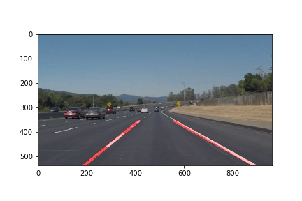
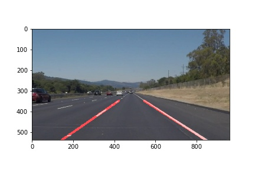
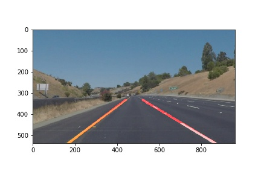
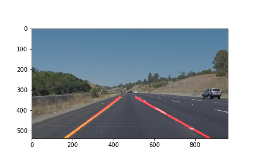
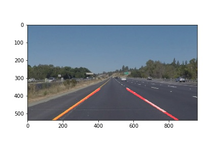
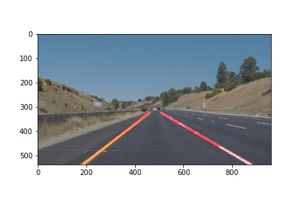

# **Finding Lane Lines on the Road** 

## Writeup

*Finding Lane Lines on the Road*

The goals/steps of this project are the following:
* Make a pipeline that finds lane lines on the road
* Reflect on your work in a written report

---

## Reflection

### 1. Pipeline description. 

My pipeline consisted of 8 steps: 
* Convert the images to grayscale.
* Apply Gaussian blur.
* Apply Canny filter.
* Apply a clipping mask to minimize the search region.
* Find Hough lines.
* Analyze found Hough lines to calculate properties of left and right lines of the lane.
* Using calculated properties (slope and offset), draw the lines
* Merge original and lines images to get the desired result.

In order to draw a single line on the left and right lanes, I modified the draw_lines() function in such a way that it divides the Hough lines into two categories, inclined to the left and to right. Then, while iterating through the Hough lines, I collected slope and offset of the lines so that after finishing the main loop I could calculate average slope and offset of the left and right lines.
Having calculated slopes and offsets, I could extrapolate coordinates of the left and right lines from estimated lane's apex to the image bottom edge.

Examples of pipeline results can be seen on the following images: 

### 2. Potential shortcomings with the current pipeline

One potential shortcoming would be overfitting of the pipeline for testing images set. That is, parameters used by transformation steps (e. g. threshold values for Canny filter or parameters for Hough line detection) are hard coded.

Another shortcoming could be a naive approach to find lines slope, offset, and lines extrapolation. That approach is unreliable and detects lines with a big value of the error, especially in the case of the misconfigured pipeline.

### 3. Possible improvements to the pipeline

A possible improvement would be to apply machine learning for choosing pipeline parameters depending on processed image or video.

Another potential improvement could be a more sophisticated algorithm to draw lines. For example, we could assume that lines should be on the left and right edges of a trapezoid, and therefore filter out Hough lines that are too far from the edges of such a trapezoid.

